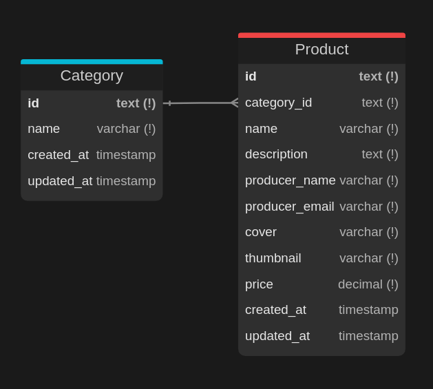

# Sellit — Desafio de Backend

Este projeto implementa uma API RESTful desenvolvida com **Next.js** e **TypeScript**, utilizando **PostgreSQL** como banco de dados e **Drizzle ORM** para modelagem e persistência dos dados.

A estrutura do projeto foi cuidadosamente planejada visando **manutenibilidade**, **escalabilidade** e **facilidade de entendimento**. Adotei uma arquitetura modular com separação clara de responsabilidades entre camadas como: controllers, repositórios, validações e schemas. A conexão com o banco de dados segue o padrão **Singleton**, e os controllers utilizam **Programação Orientada a Objetos (POO)** para maior coesão e extensibilidade.

A documentação da API está disponível na **página inicial do projeto** (raiz da aplicação), em formato **Swagger/OpenAPI**.

## Tecnologias Utilizadas

- Next.js
- TypeScript
- PostgreSQL
- Drizzle ORM
- Zod (validações)
- Docker & Docker Compose
- Biome (Lint)
- Swagger/OpenAPI

## Estrutura Modular

O projeto está dividido em módulos (`/modules`) para facilitar a evolução da aplicação. Cada módulo encapsula suas responsabilidades:

- `products/`: gerenciamento de produtos
- `categories/`: gerenciamento de categorias
- `lib/database/`: conexão e manipulação do banco
- `lib/errors/`: tratamento e formatação de erros

## Diagrama de Schema


## Scripts disponíveis (NPM)

```bash
# Sobe o ambiente com Docker
npm run dev:docker:up

# Executa as migrações e cria as tabelas
npm run dev:db:migrate

# Executa o seed com dados fictícios
npm run dev:db:seed

# Inicia o servidor Next.js
npm run dev
```

Outros scripts úteis:

```bash
npm run dev:docker:down     # Encerra os containers Docker
npm run dev:db:migrate      # Executa as migrações (Drizzle)
npm run dev:db:generate     # Gera as migrações (Drizzle)
npm run dev:db:reset        # Remove e recria a base com seed
npm run dev:db:studio       # Abre o painel visual do Drizzle
```

## Rotas da API

Todas as rotas estão documentadas via Swagger na página inicial (`/`), e seguem o padrão RESTful de leitura e criação de recursos:

### Produtos (`/api/products`)

- `GET /api/products`: Lista produtos ou realiza busca por nome ou produtor (`?q=`).
- `POST /api/products`: Cria um novo produto.
- `GET /api/products/{id}`: Retorna um produto por ID.

### Categorias (`/api/categories`)

- `GET /api/categories`: Lista todas as categorias.
- `POST /api/categories`: Cria uma nova categoria.
- `GET /api/categories/{id}`: Retorna uma categoria por ID.

## Execução em Produção

Para executar em produção, basta definir as variáveis de ambiente adequadas no arquivo `.env.production`. O projeto já está preparado para múltiplos ambientes com isolamento adequado de configuração.

---

Desenvolvido por **Lucas Jones**
🔗 [Portfólio](https://lucasjcfreire.vercel.app) | [LinkedIn](https://www.linkedin.com/in/lucasjcfreire/)
